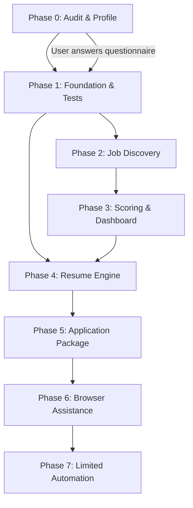

# Implementation Roadmap

**Author:** Principal Architect  
**Date:** 2026-07-23  
**Status:** DRAFT — awaiting user review

---

## Phasing Principles

1. Each phase is independently testable and demoable.
2. No phase enables outbound communication or submission without explicit approval.
3. Phases build on verified outputs from previous phases — never on assumptions.
4. The candidate profile is the foundation. Everything downstream depends on it.

---

## Phase 0 — Audit, Profile, and Project Skeleton

**Duration:** 1-2 sessions  
**Approval gate:** User verifies candidate facts and answers the questionnaire.

### Deliverables

| # | Task | Output |
|---|---|---|
| 0.1 | Extract and audit CV facts | `docs/CV_SOURCE_AUDIT.md` |
| 0.2 | Generate prioritized questionnaire | `docs/MISSING_CANDIDATE_INFORMATION.md` |
| 0.3 | Create candidate JSON schemas (Zod) | `packages/core/src/candidate/` |
| 0.4 | Populate initial profile from CV | `candidate/profile.public.json`, `candidate/profile.private.json` |
| 0.5 | Create verified skill/experience/project files | `candidate/skills.verified.json`, etc. |
| 0.6 | Set up repository structure | All directories, `pnpm-workspace.yaml`, `turbo.json`, `tsconfig.base.json` |
| 0.7 | Create `.gitignore` with all private exclusions | `.gitignore` |
| 0.8 | Create `.env.example` | `.env.example` |
| 0.9 | Create `README.md` and `AGENTS.md` | Root files |
| 0.10 | Create all `docs/` files | Architecture, security, source compliance, resume engine docs |
| 0.11 | Create `PROJECT_STATUS.md` and `NEXT_ACTIONS.md` | Root files |

### Stop Condition
The agent stops and presents:
- The CV audit with flagged ambiguities
- The questionnaire for the user to answer
- The populated profile for the user to verify

**No code execution or feature implementation until the user confirms facts.**

---

## Phase 1 — Foundation: Types, Database, Classification, Tests

**Duration:** 2-3 sessions  
**Approval gate:** All tests pass. Security review is clean.  
**Depends on:** Phase 0 user verification complete.

### Deliverables

| # | Task | Output |
|---|---|---|
| 1.1 | Initialize pnpm workspace and Turborepo | `package.json`, `pnpm-workspace.yaml`, `turbo.json` |
| 1.2 | Create `packages/core` with Zod schemas | Job types, score types, candidate types, constants |
| 1.3 | Create `packages/db` with Drizzle schema | `schema.ts`, initial migration, SQLite setup |
| 1.4 | Build Phase 1 tables only | `candidate_profiles`, `candidate_evidence`, `job_sources`, `jobs`, `workflow_runs`, `audit_events` |
| 1.5 | Create `packages/classification` | PH/international classifier, work-setup classifier, eligibility checker |
| 1.6 | Write classification tests with fixtures | ≥20 test cases covering spec rules |
| 1.7 | Create deduplication logic | Title + company + location + date heuristic |
| 1.8 | Write deduplication tests | Same job across sources, reposts, title variations |
| 1.9 | Create `packages/scoring` — deterministic layer | Hard rejection rules, 100-point factor scoring |
| 1.10 | Write scoring tests | Score bounds, hard-reject override, verified-skill-only validation |
| 1.11 | Set up Vitest workspace config | `vitest.workspace.ts` |
| 1.12 | Create test fixtures | 15-20 realistic job listings (PH remote, PH onsite, intl remote, intl rejected, scam patterns, edge cases) |

### Classification Test Matrix

```
┌──────────────────────────────┬──────────────┬──────────────────────┐
│ Scenario                     │ Expected     │ Rationale            │
├──────────────────────────────┼──────────────┼──────────────────────┤
│ PH remote, Manila            │ PH_REMOTE    │ Direct match         │
│ PH hybrid, Makati 3x/week    │ PH_HYBRID    │ Location review      │
│ PH onsite, Boac              │ PH_ONSITE    │ Home location        │
│ PH onsite, Cebu              │ LOCATION_REV │ Outside home         │
│ Intl remote, "Worldwide"     │ INTL_REMOTE  │ PH eligible          │
│ Intl remote, "APAC"          │ INTL_REMOTE  │ PH in APAC           │
│ Intl remote, "US only"       │ INELIGIBLE   │ PH excluded          │
│ Intl remote, "EU residents"  │ INELIGIBLE   │ PH excluded          │
│ Intl hybrid, Singapore       │ INELIGIBLE   │ Intl non-remote      │
│ Intl remote, no region info  │ ELIGIB_REVIEW│ Cannot confirm       │
│ "Remote" but requires visa   │ INELIGIBLE   │ Contradictory        │
│ Commission-only MLM pattern  │ HARD_REJECT  │ Scam pattern         │
│ Expired listing              │ HARD_REJECT  │ No longer valid      │
│ Senior role, 8+ years req    │ HARD_REJECT  │ Experience mismatch  │
│ Duplicate, different source  │ DUPLICATE    │ Dedup match          │
└──────────────────────────────┴──────────────┴──────────────────────┘
```

---

## Phase 2 — Job Discovery and Ingestion

**Duration:** 2-3 sessions  
**Approval gate:** Source compliance review. Adapters work with test data.  
**Depends on:** Phase 1 tests passing.

### Deliverables

| # | Task | Output |
|---|---|---|
| 2.1 | Define source adapter interface | `packages/ingestion/src/adapter.ts` |
| 2.2 | Build manual URL adapter | Paste a job URL → extract and normalize |
| 2.3 | Build email alert adapter (Gmail API) | Parse job alert emails → structured jobs |
| 2.4 | Build RSS/Atom feed adapter | Ingest from configured RSS feeds |
| 2.5 | Normalization pipeline | Raw → normalized job with all spec fields |
| 2.6 | Deduplication integration | Run dedup on every ingestion batch |
| 2.7 | Expiry detection | Mark expired/removed listings |
| 2.8 | Source snapshot storage | Save raw source data for audit |
| 2.9 | Update `docs/SOURCE_COMPLIANCE.md` | Document each source's access method and restrictions |
| 2.10 | Trigger.dev tasks: `ingest-email`, `ingest-rss`, `normalize`, `dedup` | `trigger/src/` |
| 2.11 | Integration tests with real fixture emails/feeds | `tests/integration/` |

---

## Phase 3 — Scoring, Dashboard MVP, and Reports

**Duration:** 3-4 sessions  
**Approval gate:** User reviews sample scored results on the dashboard.  
**Depends on:** Phase 2 adapters working.

### Deliverables

| # | Task | Output |
|---|---|---|
| 3.1 | AI scoring integration | Connect classification → AI fit analysis → structured score |
| 3.2 | AI provider abstraction | Support at least one model with swap-ability |
| 3.3 | AI output validation | Zod-validate all LLM responses, reject + retry on failure |
| 3.4 | Dashboard: PH Opportunities view | Filter, sort, score display |
| 3.5 | Dashboard: International WFH view | Eligibility evidence, time zone display |
| 3.6 | Dashboard: Job Detail view | Full job text, classification evidence, score breakdown |
| 3.7 | Dashboard: Settings view | Preferences, source config, kill switch |
| 3.8 | Trigger.dev tasks: `classify-and-filter`, `score-eligible`, `daily-report` | `trigger/src/` |
| 3.9 | Daily report generation (Markdown or dashboard view) | Summary of new/priority/error jobs |

---

## Phase 4 — Resume Engine

**Duration:** 3-4 sessions  
**Approval gate:** User approves resume templates and first generated outputs.  
**Depends on:** Verified candidate profile (Phase 0 answers) + Phase 3 scoring.

### Deliverables

| # | Task | Output |
|---|---|---|
| 4.1 | Resume parser (DOCX → structured data) | `packages/resume/src/parser.ts` |
| 4.2 | Fact mapper (profile → resume sections) | `packages/resume/src/mapper.ts` |
| 4.3 | Resume generator (sections → DOCX + PDF) | `packages/resume/src/generator.ts` |
| 4.4 | Quality gates: fact-check, keyword, seniority, ATS, consistency | `packages/resume/src/quality.ts` |
| 4.5 | Master resume profiles (start with 2) | `resumes/master/` |
| 4.6 | Job-specific tailoring algorithm | Per-job resume generation |
| 4.7 | Dashboard: Resume Review view | Preview, diff, approve/regenerate |
| 4.8 | Trigger.dev task: `generate-resume-package` | `trigger/src/` |
| 4.9 | Resume generation tests | Fact mapping, ATS text extraction, one-page validation |

---

## Phase 5 — Application Package and Workflow

**Duration:** 2-3 sessions  
**Approval gate:** User approves wording and sensitive-question policy.  
**Depends on:** Phase 4 resume engine producing approved outputs.

### Deliverables

| # | Task | Output |
|---|---|---|
| 5.1 | Cover letter generator | Company/role-specific, evidence-based |
| 5.2 | Recruiter message generator | Short LinkedIn/email-style messages |
| 5.3 | Answer bank integration | Draft answers from verified bank; hold sensitive questions |
| 5.4 | Application package assembler | Resume + cover letter + answers + match report |
| 5.5 | Dashboard: Application Queue view | Ready packages, pending questions, approval buttons |
| 5.6 | Dashboard: Applications tracking view | Status history, follow-ups |
| 5.7 | Add database tables: `application_packages`, `applications`, `resume_versions` | Migration |
| 5.8 | Interview brief generator | Likely questions, verified examples, gap preparation |

---

## Phase 6 — Browser Assistance (Read-Only + Prefill)

**Duration:** 2-3 sessions  
**Approval gate:** Per-source testing and user approval.  
**Depends on:** Phase 5 packages approved.

### Deliverables

| # | Task | Output |
|---|---|---|
| 6.1 | Install Playwright | Dev dependency |
| 6.2 | Build browser session manager | Dedicated profile, cookie isolation |
| 6.3 | Build prefill engine | Populate form fields from application package |
| 6.4 | **Hard stop before submit** | Screenshot, user confirmation required |
| 6.5 | Per-source allowlist | Only tested, approved sites |
| 6.6 | Browser test suite | Prefill test pages, confirmation stop, failure recovery |

---

## Phase 7 — Limited Automation (Future)

**Duration:** TBD  
**Approval gate:** Explicit user opt-in per method.  
**Depends on:** Phase 6 browser prefill proven stable.

Not detailed here. Requires separate design document after Phases 0-6 are complete.

---

## Dependency Graph



> [!NOTE]
> Phase 4 (Resume Engine) can begin in parallel with Phase 2-3 once the candidate
> profile is verified, since it depends on the profile, not on live job data. The
> proof-of-concept resume parser is part of Phase 0/1.
